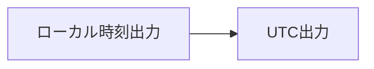
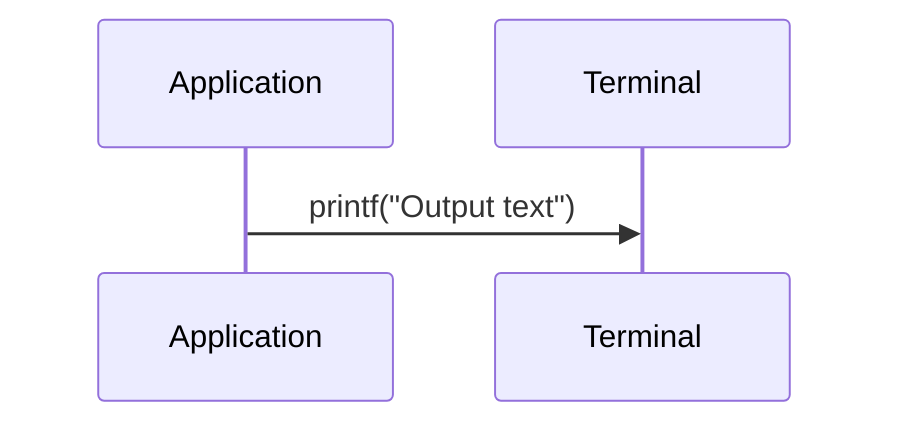
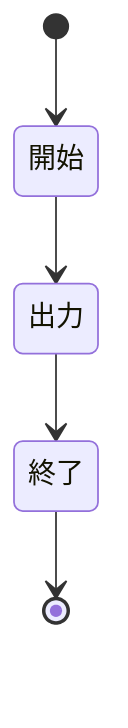
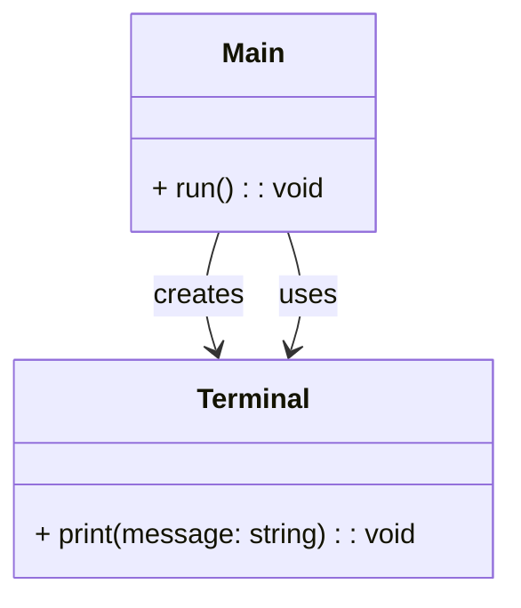

# coderabbittest
coderabbitテスト用リポジトリ

## 処理フロー

```mermaid
graph LR;
A[ローカル時刻出力] --> B[UTC出力]
```

## 出力シーケンス

```mermaid
sequenceDiagram
    participant App as Application
    participant Terminal as Terminal

    App->>Terminal: printf("Output text")
```

## 状態遷移

```mermaid
stateDiagram-v2
    [*] --> 開始
    開始 --> 出力
    出力 --> 終了
    終了 --> [*]
```

## クラス図

```mermaid
classDiagram
    class Main {
        + run(): void
    }

    class Terminal {
        + print(message: string): void
    }

    Main --> Terminal: creates
    Main --> Terminal: uses
```

